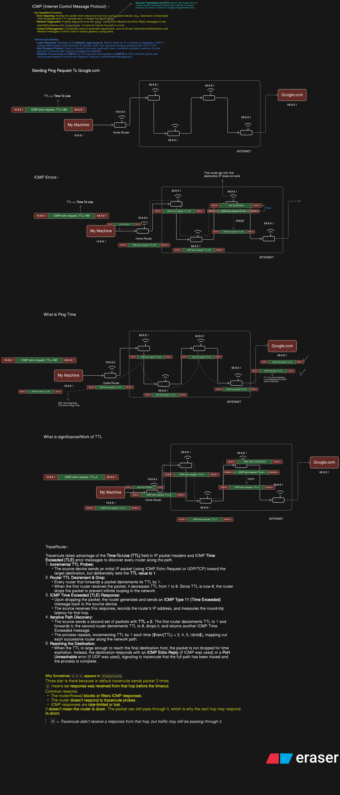
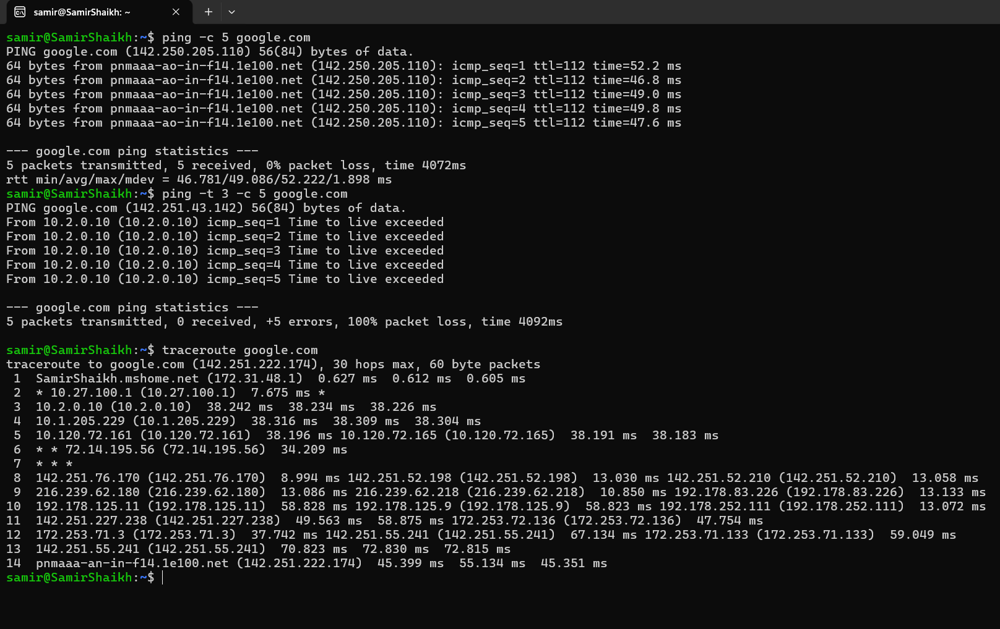

# ICMP, TTL, Ping & Traceroute

A practical networking study note explaining how **ICMP**, **TTL (Time To Live)**, `ping`, and `traceroute` work at the packet level.

The diagrams and terminal output in this repository are based on a hands-on experiment using Linux.



---

## 1. ICMP — Internet Control Message Protocol

**ICMP** is a network-layer protocol used primarily for **error reporting, diagnostics, and control messages** in IP networks.

It is not used to carry application data like HTTP. Instead, it helps hosts and routers communicate information about IP packet delivery.

### Common ICMP uses

- **Echo Request / Echo Reply** → used by `ping`
- **Time Exceeded** → used by `traceroute` when TTL reaches `0`
- **Destination Unreachable** → indicates that a destination or service cannot be reached
- **Packet Too Big** → important for Path MTU Discovery
- **Redirect** → can inform a host about a better routing path

> ICMP is an important part of understanding how tools such as `ping` and `traceroute` work.

---

## 2. How `ping` works

A normal ping sends an **ICMP Echo Request** to the destination.

For example:

```bash
ping -c 5 google.com
```

The destination responds with **ICMP Echo Reply** packets.

```text
Your Machine
     |
     | ICMP Echo Request
     v
  Routers
     |
     v
  Google
     |
     | ICMP Echo Reply
     v
Your Machine
```

The time taken for the request and reply to complete is shown as the **round-trip time (RTT)**.

### Example

```text
64 bytes from google.com:
icmp_seq=1 ttl=112 time=52.2 ms
```

Here:

- `icmp_seq=1` → sequence number of the ICMP packet
- `ttl=112` → TTL remaining in the received reply
- `time=52.2 ms` → round-trip time

---

## 3. What is TTL?

**TTL (Time To Live)** is a field in the IP header that prevents packets from circulating around a network forever.

Every router that forwards an IP packet decreases its TTL by **1**.

```text
TTL = 3

Your Machine
     |
     | TTL 3
     v
 Router 1
     |
     | TTL 2
     v
 Router 2
     |
     | TTL 1
     v
 Router 3
     |
     | TTL 0
     X
```

When TTL reaches `0`, the router discards the packet and normally sends an:

```text
ICMP Time Exceeded
```

message back to the sender.

This mechanism is what makes `traceroute` possible.

---

## 4. Testing TTL manually

On Linux, TTL can be specified using `-t`.

```bash
ping -t 3 -c 5 google.com
```

This sends 5 ICMP Echo Requests with an initial TTL of `3`.

In the experiment, the result was:

```text
From 10.2.0.10 (10.2.0.10) icmp_seq=1 Time to live exceeded
...
5 packets transmitted, 0 received, +5 errors, 100% packet loss
```

This does **not** mean Google is unreachable.

It means the packets' TTL became `0` before reaching Google. The router at `10.2.0.10` generated the ICMP **Time Exceeded** message.

---

## 5. What is Ping Time?

The `time` shown by `ping` represents the **round-trip time (RTT)**:

```text
Your Machine
     |
     | Echo Request
     v
   Google
     |
     | Echo Reply
     v
Your Machine

        <---- RTT ---->
```

For example:

```text
time=52.2 ms
```

means the request travelled to the destination and the reply travelled back in approximately **52.2 milliseconds**.

Network latency can vary between packets because of routing, congestion, queuing, and other network conditions.

---

## 6. How Traceroute Works

`traceroute` uses progressively increasing TTL values to discover the routers along the path.

### Step 1 — TTL = 1

```text
Your Machine
     |
     | TTL = 1
     v
Router 1
     X
```

Router 1 decrements TTL from `1` to `0`, drops the packet, and sends an **ICMP Time Exceeded** message back.

Traceroute learns:

```text
Hop 1 → Router 1
```

### Step 2 — TTL = 2

```text
Your Machine
     |
     v
Router 1
     |
     v
Router 2
     X
```

Router 2 becomes the point where TTL reaches `0`.

Traceroute learns:

```text
Hop 2 → Router 2
```

The process continues until the destination is reached.

---

## 7. Reading the Traceroute Output

Example from the experiment:

```text
1  SamirShaikh.mshome.net (172.31.48.1) ...
2  * 10.27.100.1 (10.27.100.1) ... *
3  10.2.0.10 (10.2.0.10) ...
...
7  * * *
...
14 pnmaaaa-ao-in-f14.1e100.net (142.251.222.174) ...
```

Each numbered line represents a **hop** along the path.

Traceroute normally sends multiple probes per hop, which is why a hop can contain multiple IP addresses and latency values.

For example:

```text
5  10.120.72.161 ... 10.120.72.165 ... 10.120.72.161 ...
```

This can happen when different probes take different paths or are handled by different routers/interfaces.

---

## 8. Why `* * *` appears

Here is the actual terminal output from the experiment:



A `*` means:

> **Traceroute did not receive the expected response from that probe before the timeout.**

Common reasons include:

- The router/firewall filters ICMP responses.
- The router is configured not to respond to traceroute probes.
- ICMP responses are rate-limited.
- The response was lost somewhere on the return path.

For example:

```text
7  * * *
8  142.251.76.170 ...
```

The `* * *` at hop 7 does **not** necessarily mean that hop is down.

The packet may still have been forwarded through that router, which is why a later hop can respond.

### Key idea

```text
* = no traceroute response received
    ≠
    router is definitely down
```

---

## 9. Ping vs Traceroute

| Tool | Main purpose | How it works |
|---|---|---|
| `ping` | Test reachability and latency | ICMP Echo Request/Reply |
| `traceroute` | Discover the path to a destination | Manipulates TTL and observes ICMP responses |
| TTL | Prevent packets from looping forever | Decreased by each router |

---

## 10. The Complete Picture

The relationship between these concepts can be summarized as:

```text
                    IP Packet
                       |
                       v
                 ┌───────────┐
                 │    TTL    │
                 └─────┬─────┘
                       |
              Router forwards packet
                       |
                   TTL = TTL - 1
                       |
                 ┌─────┴─────┐
                 │ TTL == 0? │
                 └─────┬─────┘
                    Yes│
                       v
              Drop the packet
                       |
                       v
            ICMP Time Exceeded
                       |
                       v
               Traceroute learns
                  the hop
```

---

## References / Experiments

The two images above are the visual references for the concepts and experiments documented in this README.

---

## Key Takeaways

1. **ICMP** provides diagnostic and error-reporting messages for IP networks.
2. **Ping** uses ICMP Echo Request and Echo Reply to test connectivity and measure RTT.
3. **TTL** is decreased by every forwarding router.
4. When TTL reaches `0`, the packet is dropped and an **ICMP Time Exceeded** message can be generated.
5. **Traceroute** exploits TTL expiration to discover routers along a path.
6. `*` in traceroute means **no response was received before the timeout**, not necessarily that the router is down.
