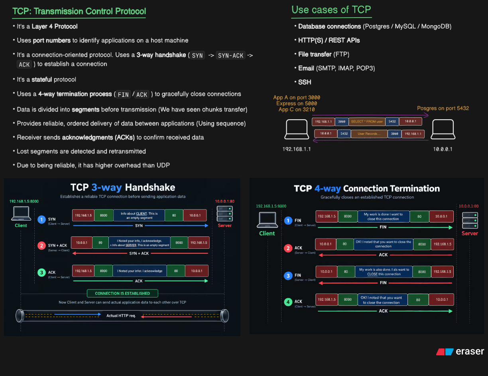
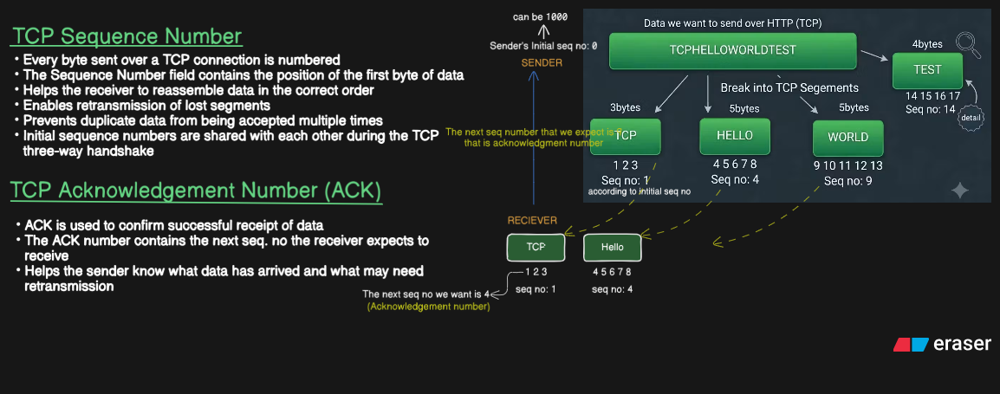

# TCP --- Transmission Control Protocol

TCP (Transmission Control Protocol) is a **connection-oriented,
stateful, reliable transport-layer protocol**. It provides a reliable,
ordered **byte stream** between applications running on different hosts.

This README follows the TCP concepts in the order in which they are
easiest to understand:

1.  **TCP introduction**
2.  **TCP 3-way handshake**
3.  **TCP 4-way connection termination**
4.  **Sequence Number and Acknowledgment Number**
5.  **TCP Segment Anatomy --- field-by-field, in depth**

------------------------------------------------------------------------

## 1. TCP --- Transmission Control Protocol

TCP operates at **Layer 4 (Transport Layer)** of the TCP/IP model.

Its job is to provide communication between applications rather than
merely between machines.

For example:

``` text
Client
192.168.1.5:8000
        |
        | TCP connection
        |
Server
10.0.0.1:80
```

The IP addresses identify the hosts, while the **port numbers identify
the applications/endpoints** on those hosts.

### What TCP provides

TCP provides:

-   Connection establishment
-   Reliable delivery
-   Ordered delivery
-   Error detection
-   Retransmission of lost data
-   Duplicate detection
-   Flow control
-   Congestion control
-   Full-duplex communication
-   Graceful connection termination

TCP achieves these using mechanisms such as:

``` text
Sequence Numbers
Acknowledgment Numbers
ACKs
Receive Window
Retransmission
TCP Flags
Checksum
TCP Options
Congestion Control
```

### TCP is a byte-stream protocol

One of the most important things to understand is that TCP does **not**
preserve application message boundaries.

Suppose an application writes:

``` text
HELLO
WORLD
```

TCP sees a continuous stream of bytes:

``` text
H E L L O W O R L D
```

TCP may divide that stream into segments differently from how the
application wrote it.

Therefore:

> TCP provides an ordered byte stream, not a message-oriented protocol.

This is one reason the **Sequence Number** is so important.

------------------------------------------------------------------------

# 2. TCP Uses Ports to Identify Applications

Every TCP segment contains:

``` text
Source Port       16 bits
Destination Port  16 bits
```

Suppose:

``` text
Client:
192.168.1.5:8000

Server:
10.0.0.1:80
```

Client → Server:

``` text
Source Port      = 8000
Destination Port = 80
```

Server → Client:

``` text
Source Port      = 80
Destination Port = 8000
```

The IP addresses identify the hosts and the ports identify the TCP
endpoints on those hosts.

A TCP connection is commonly identified by a **4-tuple**:

``` text
Source IP
Source Port
Destination IP
Destination Port
```

For example:

``` text
192.168.1.5 : 8000
        ↓
10.0.0.1 : 80
```

------------------------------------------------------------------------

# 3. TCP 3-Way Handshake

Before application data is normally exchanged, TCP establishes a
connection using the **3-way handshake**.

The three packets are:

``` text
1. SYN
2. SYN + ACK
3. ACK
```



------------------------------------------------------------------------

## 3.1 Step 1 --- SYN

The client sends a TCP segment with the **SYN flag set**.

Conceptually:

``` text
Client → Server

SYN = 1
SEQ = X
```

The client is saying:

> "I want to establish a TCP connection, and my initial sequence number
> is X."

The sequence number is important because TCP must establish where this
connection's byte stream begins.

The client can also use TCP options during the handshake, such as:

-   MSS
-   Window Scale
-   SACK Permitted
-   Timestamp

These options allow the endpoints to negotiate capabilities.

------------------------------------------------------------------------

## 3.2 Step 2 --- SYN + ACK

The server responds with both **SYN** and **ACK** set.

Conceptually:

``` text
Server → Client

SYN = 1
ACK = 1
SEQ = Y
ACK = X + 1
```

The server is doing two things at once:

1.  Starting its own sequence-number space with `Y`.
2.  Acknowledging the client's SYN.

Why `ACK = X + 1`?

Because a SYN consumes **one sequence number**, even though it does not
carry application data.

So:

``` text
Client SYN:
SEQ = X

Server:
ACK = X + 1
```

------------------------------------------------------------------------

## 3.3 Step 3 --- ACK

The client sends the final ACK:

``` text
Client → Server

ACK = 1
SEQ = X + 1
ACK = Y + 1
```

Now both sides have confirmed the initial sequence numbers.

``` text
TCP connection established
```

Application data can now be exchanged.

------------------------------------------------------------------------

## 3.4 Why is it called a 3-way handshake?

Because both sides need to establish and acknowledge their
sequence-number state.

Conceptually:

``` text
Client                          Server

"I want to connect."
       SYN
       ----------------------->

                    "I received yours,
                     and here is mine."
                    SYN + ACK
       <-----------------------

"I received yours."
       ACK
       ----------------------->
```

The handshake is therefore more than simply "opening a socket." It
establishes the initial TCP state and negotiates relevant options.

------------------------------------------------------------------------

# 4. TCP 4-Way Connection Termination

TCP is **full-duplex**.

That means there are logically two independent directions:

``` text
Client → Server
Server → Client
```

Because each direction can be closed independently, normal TCP
termination commonly takes four segments.


> The image above also shows the 4-way termination flow. The same TCP
> basics image contains the handshake and termination diagrams.

------------------------------------------------------------------------

## 4.1 Step 1 --- Client sends FIN

Suppose the client has finished sending application data.

It sends:

``` text
FIN = 1
```

Conceptually:

``` text
Client → Server

FIN
```

Meaning:

> "I have finished sending data in this direction."

This does **not necessarily mean that the entire TCP connection
disappears immediately**.

The server may still send data to the client.

------------------------------------------------------------------------

## 4.2 Step 2 --- Server ACKs the FIN

The server acknowledges the client's FIN:

``` text
Server → Client

ACK
```

The server is effectively saying:

> "I received your request to stop sending."

The server may still have data to send.

------------------------------------------------------------------------

## 4.3 Step 3 --- Server sends its FIN

When the server has also finished sending:

``` text
Server → Client

FIN
```

Now the server is saying:

> "I have finished sending in my direction too."

------------------------------------------------------------------------

## 4.4 Step 4 --- Client sends final ACK

The client acknowledges:

``` text
Client → Server

ACK
```

The connection can then proceed through the remaining TCP closing states
until it is fully closed.

------------------------------------------------------------------------

## 4.5 FIN vs RST

These two must not be confused.

### FIN

Graceful shutdown:

``` text
"I am done sending."
```

### RST

Reset/abort:

``` text
"Terminate/reset this connection."
```

FIN allows TCP to finish the normal shutdown process.

RST is used when a connection needs to be rejected or aborted rather
than gracefully completed.

------------------------------------------------------------------------

# 5. Sequence Number and Acknowledgment Number

Now we reach the most important part of TCP reliability.



TCP uses:

``` text
Sequence Number
+
Acknowledgment Number
```

to track the byte stream.

------------------------------------------------------------------------

# 6. TCP Sequence Number

The TCP Sequence Number identifies the position of data in the TCP byte
stream.

The key rule is:

> **The sequence number identifies the sequence number of the first byte
> of data carried by that segment.**

Suppose the sender has:

``` text
Initial sequence number = 1
```

and wants to send:

``` text
TCPHELLOWORLDTEST
```

Assume TCP divides it into:

``` text
TCP
HELLO
WORLD
TEST
```

The byte positions could be:

``` text
TCP

T C P
1 2 3

SEQ = 1
```

Next:

``` text
HELLO

H E L L O
4 5 6 7 8

SEQ = 4
```

Next:

``` text
WORLD

W O R L D
9 10 11 12 13

SEQ = 9
```

Next:

``` text
TEST

T E S T
14 15 16 17

SEQ = 14
```

The important point is that the sequence number advances according to
**bytes**, not according to packets.

------------------------------------------------------------------------

# 7. Sequence Numbers Are About Bytes, Not Segments

This is a common source of confusion.

Suppose:

``` text
Segment 1:
SEQ = 1
Length = 3

Segment 2:
SEQ = 4
Length = 5

Segment 3:
SEQ = 9
Length = 5
```

Why does segment 2 start at 4?

Because segment 1 carried bytes:

``` text
1, 2, 3
```

Therefore the next byte is:

``` text
4
```

Likewise:

``` text
SEQ 9
```

means:

> "The first byte in this segment is byte 9."

------------------------------------------------------------------------

# 8. Acknowledgment Number

The ACK number tells the sender:

> **The next sequence number I expect to receive.**

This is one of the most important TCP rules.

Suppose the receiver receives:

``` text
SEQ = 1
Length = 3
```

It received:

``` text
1
2
3
```

The next byte it wants is:

``` text
4
```

Therefore:

``` text
ACK = 4
```

So:

``` text
ACK = next expected byte
```

not:

``` text
ACK = last byte received
```

------------------------------------------------------------------------

# 9. Sequence Number + ACK Example

Suppose:

``` text
Client → Server

SEQ = 1000
Length = 500 bytes
```

The client sends bytes:

``` text
1000
1001
1002
...
1499
```

The next byte is:

``` text
1500
```

Therefore the server can acknowledge:

``` text
ACK = 1500
```

Meaning:

> "I have received everything through byte 1499, and I expect byte 1500
> next."

------------------------------------------------------------------------

# 10. Why Sequence and ACK Numbers Make TCP Reliable

These numbers allow TCP to:

### 1. Detect missing data

If the receiver is expecting:

``` text
1000
```

but receives data beginning at:

``` text
1200
```

there is a gap.

### 2. Reassemble out-of-order data

Suppose segments arrive:

``` text
SEQ 200
SEQ 100
SEQ 300
```

TCP can use sequence numbers to place the bytes in the correct order.

### 3. Detect duplicates

If the same sequence range arrives again, TCP can recognize already
received data.

### 4. Retransmit lost data

If data is not successfully acknowledged, TCP's retransmission
mechanisms can send it again.

------------------------------------------------------------------------

# 11. Cumulative ACKs

TCP acknowledgments are generally **cumulative**.

Suppose the receiver has received:

``` text
1–100
```

and therefore sends:

``` text
ACK = 101
```

This means:

> "I have received all bytes before 101 in the relevant contiguous
> sequence space."

If a later segment arrives but an earlier segment is missing, the ACK
may continue indicating the next missing byte.

For example:

``` text
Received:
1–100
101–200
301–400

Missing:
201–300
```

The receiver cannot normally advance the cumulative ACK beyond the
missing range merely because 301--400 arrived.

This is where **SACK** becomes useful.

------------------------------------------------------------------------

# 12. SACK --- Selective Acknowledgment

SACK is a TCP option.

Without SACK, the sender has less precise information about which later
blocks arrived beyond a gap.

With SACK, the receiver can communicate additional received ranges.

For example:

``` text
Received:

1–100       ✓
101–200     ✓
201–300     ✗
301–400     ✓
401–500     ✓
```

The receiver can communicate:

``` text
"I still need 201–300,
but I already have 301–500."
```

This lets the sender retransmit the missing range more efficiently.

------------------------------------------------------------------------

# 13. TCP Segment Anatomy

Now that the connection lifecycle and sequence/ACK system are clear, the
TCP header itself becomes much easier to understand.


A TCP segment consists conceptually of:

``` text
+---------------------------------------+
|           TCP Header                  |
|             20–60 bytes              |
+---------------------------------------+
|                                       |
|          Application Data             |
|          0 or more bytes              |
|                                       |
+---------------------------------------+
```

The TCP header is:

``` text
Minimum = 20 bytes
Maximum = 60 bytes
```

Why?

``` text
20 bytes mandatory header
+
0–40 bytes optional TCP options
=
20–60 bytes
```

------------------------------------------------------------------------

# 14. TCP Header Bit Layout

The header is commonly represented as a 32-bit-wide diagram.

The bit positions are:

``` text
0                 7 8                15 16               23 24               31
+------------------+------------------+------------------+------------------+
|    1st Byte      |    2nd Byte      |    3rd Byte      |    4th Byte      |
+------------------+------------------+------------------+------------------+
```

Each row is:

``` text
32 bits = 4 bytes
```

The fixed TCP header contains several fields with different widths.

------------------------------------------------------------------------

# 15. Source Port and Destination Port

``` text
Source Port       = 16 bits
Destination Port  = 16 bits
```

Example:

``` text
Client:
192.168.1.5:8000

Server:
10.0.0.1:80
```

Client → Server:

``` text
Source      = 8000
Destination = 80
```

Server → Client:

``` text
Source      = 80
Destination = 8000
```

Ports answer:

> "Which application/process is this TCP traffic associated with?"

------------------------------------------------------------------------

# 16. Sequence Number --- 32 bits

``` text
Sequence Number = 32 bits
```

It identifies the position of the first data byte carried by the
segment.

Example:

``` text
SEQ = 1000
Length = 500
```

Then the segment carries:

``` text
1000–1499
```

and the next expected byte is:

``` text
1500
```

Special rule:

``` text
SYN consumes one sequence number.
FIN consumes one sequence number.
```

Normal data consumes sequence numbers according to its byte length.

------------------------------------------------------------------------

# 17. Acknowledgment Number --- 32 bits

``` text
Acknowledgment Number = 32 bits
```

When ACK is valid, it tells the sender:

``` text
"The next sequence number I expect."
```

Example:

``` text
Received:
1000–1499

ACK:
1500
```

The receiver has therefore cumulatively acknowledged those bytes.

------------------------------------------------------------------------

# 18. Data Offset

The **Data Offset** field tells the receiver where the TCP payload
begins.

Why do we need it?

Because the TCP header is variable length.

``` text
Minimum header = 20 bytes
Maximum header = 60 bytes
```

The Data Offset is expressed in **32-bit words**.

Since:

``` text
1 word = 32 bits = 4 bytes
```

If:

``` text
Data Offset = 5
```

then:

``` text
5 × 4 = 20 bytes
```

If:

``` text
Data Offset = 15
```

then:

``` text
15 × 4 = 60 bytes
```

Therefore:

``` text
Data Offset
      ↓
TCP header length
      ↓
Where application data begins
```

------------------------------------------------------------------------

# 19. Reserved Bits

The TCP header contains reserved bits.

They are reserved for protocol use and future extensions rather than
being normal application-control flags.

They should not be treated like:

``` text
SYN
ACK
FIN
RST
```

------------------------------------------------------------------------

# 20. TCP Control Flags

The TCP header contains control flags:

``` text
CWR
ECE
URG
ACK
PSH
RST
SYN
FIN
```

These flags are easiest to understand in related groups rather than
memorizing them independently.

------------------------------------------------------------------------

# 21. SYN --- Synchronize

SYN is used for connection establishment.

``` text
Client → Server
SYN

Server → Client
SYN + ACK

Client → Server
ACK
```

SYN also consumes one sequence number.

``` text
Client:
SYN, SEQ = X

Server:
ACK = X + 1
```

------------------------------------------------------------------------

# 22. ACK --- Acknowledgment

ACK indicates that the Acknowledgment Number field is valid.

It is used throughout the connection.

Example:

``` text
SEQ = 1000
Data length = 500

Receiver:
ACK = 1500
```

ACK is not only a handshake flag.

It is a fundamental mechanism for TCP's ongoing reliability.

------------------------------------------------------------------------

# 23. FIN --- Finish

FIN is used for graceful shutdown.

It means:

> "I have finished sending data in this direction."

Because TCP is full-duplex, each side can independently close its
sending direction.

Therefore normal shutdown is commonly:

``` text
FIN
ACK
FIN
ACK
```

FIN consumes one sequence number.

------------------------------------------------------------------------

# 24. RST --- Reset

RST means that the TCP connection should be reset rather than continuing
normal operation.

It is commonly associated with situations such as:

-   Connection rejection
-   Unexpected traffic for a connection
-   Aborting a connection

Conceptually:

``` text
FIN → graceful shutdown

RST → reset/abort
```

A TCP connection that is reset does not go through the normal graceful
FIN exchange.

------------------------------------------------------------------------

# 25. PSH --- Push

PSH stands for **Push**.

It is associated with asking TCP to make received data available to the
receiving application without unnecessarily waiting for additional data
to accumulate.

Conceptually:

``` text
Network
   ↓
TCP receive buffer
   ↓
Application
```

PSH is about delivery behavior at the receiving side.

Do not think:

``` text
PSH = "send this packet immediately"
```

That is not the correct mental model.

Modern TCP implementations generally manage buffering and PSH behavior
automatically.

------------------------------------------------------------------------

# 26. URG + Urgent Pointer

These two fields should be learned together.

### URG

The URG flag indicates that the Urgent Pointer field is significant.

### Urgent Pointer

The Urgent Pointer provides information about urgent data in the TCP
sequence space.

So:

``` text
URG
 ↓
Urgent Pointer is meaningful
```

TCP urgent data has relatively specialized semantics and is uncommon in
many modern application protocols.

------------------------------------------------------------------------

# 27. ECE + CWR --- ECN

These two flags are strongly related.

They are associated with **Explicit Congestion Notification (ECN)**.

Normally, congestion can result in packet loss.

ECN provides a way for the network to indicate congestion by marking
packets.

Conceptually:

``` text
Sender
  ↓
Router
  ↓
Congestion detected
  ↓
Packet marked CE
  ↓
Receiver
  ↓
ECE
  ↓
Sender
  ↓
Reduces congestion window
  ↓
CWR
```

### ECE

ECE is used to communicate ECN-related congestion information.

### CWR

CWR means **Congestion Window Reduced**.

It indicates that the sender has reacted to congestion by reducing its
congestion window.

Therefore:

``` text
ECE → congestion indication reaches sender

CWR → sender signals that it reacted
```

------------------------------------------------------------------------

# 28. Window Size --- Flow Control

The Window Size field is about **flow control**.

Imagine:

``` text
Fast sender
     ↓↓↓↓↓↓↓↓↓
Slow receiver
```

If the sender transmits faster than the receiver can handle, the
receiver's buffers can fill.

TCP allows the receiver to advertise how much data it can currently
accept.

For example:

``` text
Window = 20,000 bytes
```

Conceptually:

> "You may have up to this much unacknowledged data outstanding based on
> my current receive capacity."

This protects the receiver.

------------------------------------------------------------------------

# 29. Flow Control vs Congestion Control

Do not mix these up.

### Flow control

Protects the **receiver**.

``` text
Window / Receive Window
        ↓
"Don't overwhelm me."
```

### Congestion control

Protects the **network**.

``` text
Congestion Window (cwnd)
        ↓
"Don't overwhelm the network."
```

A sender is constrained by both mechanisms.

Conceptually:

``` text
Data in flight
≈ min(receive window, congestion window)
```

The exact behavior depends on the TCP implementation and protocol state,
but this is the right mental model.

------------------------------------------------------------------------

# 30. Window Scale Option

The TCP Window Size field itself is 16 bits.

Its maximum direct value is:

``` text
65,535
```

Modern networks can require larger receive windows.

Therefore TCP can negotiate a **Window Scale option** during the
handshake.

Conceptually:

``` text
Advertised Window Field × Scale Factor
=
Effective Receive Window
```

For example:

``` text
Window field = 60,000
Scale factor = 8

Effective window = 480,000 bytes
```

Window scaling is negotiated during connection establishment.

------------------------------------------------------------------------

# 31. Checksum

The TCP Checksum is used to detect corruption.

Suppose a segment is sent:

``` text
Sender
   ↓
TCP segment
   ↓
Network
   ↓
One or more bits accidentally change
   ↓
Receiver
```

The receiver validates the checksum.

If the checksum is invalid, the segment is not accepted as a valid TCP
segment.

The TCP checksum covers:

-   TCP header
-   TCP data
-   An IP pseudo-header containing relevant addressing/protocol
    information

The important distinction is:

``` text
Checksum → detects corruption

Sequence + ACK + retransmission mechanisms
          → provide reliability/recovery
```

A checksum itself does not retransmit the damaged packet.

------------------------------------------------------------------------

# 32. Urgent Pointer

The Urgent Pointer is a 16-bit field.

It is meaningful when:

``` text
URG = 1
```

It provides the information needed for TCP urgent-data semantics.

For most modern application traffic, this field is rarely central to
everyday TCP debugging.

------------------------------------------------------------------------

# 33. TCP Options

TCP options extend the fixed 20-byte header.

TCP options can occupy up to:

``` text
40 bytes
```

Therefore:

``` text
20-byte base header
+
0–40 byte options
=
20–60 byte TCP header
```

Common options include:

### MSS --- Maximum Segment Size

Tells the peer the maximum TCP payload size the endpoint wants to
receive in a segment.

For example:

``` text
MSS = 1460 bytes
```

This is the TCP payload size, not the entire TCP segment size.

For a typical IPv4 + Ethernet MTU scenario:

``` text
Ethernet MTU = 1500
IPv4 header  = 20
TCP header   = 20

MSS = 1500 - 20 - 20
    = 1460
```

The actual value depends on the network path and configuration.

------------------------------------------------------------------------

## 33.1 Window Scale

Allows the effective receive window to be larger than the 16-bit Window
Size field alone permits.

------------------------------------------------------------------------

## 33.2 SACK Permitted / SACK

SACK allows more precise reporting of received blocks when there are
gaps in the byte stream.

It is especially useful when multiple segments are in flight and some
are lost.

------------------------------------------------------------------------

## 33.3 Timestamp

TCP timestamps provide additional timing information.

They can be used for:

-   More useful RTT measurements
-   PAWS (Protection Against Wrapped Sequence numbers)

------------------------------------------------------------------------

# 34. Options and Data Offset Together

These two fields are directly related.

Suppose:

``` text
Data Offset = 5
```

Then:

``` text
Header = 5 × 4
       = 20 bytes
```

No TCP options are present in the header.

Suppose:

``` text
Data Offset = 15
```

Then:

``` text
Header = 15 × 4
       = 60 bytes
```

This leaves:

``` text
60 - 20 = 40 bytes
```

for TCP options.

Therefore:

``` text
Data Offset
     ↓
determines header size
     ↓
Options occupy the extra space
     ↓
remaining bytes are TCP payload
```

------------------------------------------------------------------------

# 35. TCP Data / Payload

After the TCP header comes the application data.

For example:

``` text
HTTP request
```

could be carried inside TCP.

Conceptually:

``` text
+-----------------------+
| TCP Header            |
+-----------------------+
| HTTP application data |
+-----------------------+
```

TCP does not need to understand HTTP.

It simply provides a reliable byte stream to the application.

The application layer may be:

-   HTTP
-   HTTPS
-   SSH
-   FTP
-   SMTP
-   IMAP
-   Database protocols
-   Other TCP-based protocols

------------------------------------------------------------------------

# 36. TCP Segment Size

The total TCP segment is:

``` text
TCP Header + TCP Data
```

The header is:

``` text
20–60 bytes
```

The data length depends on the current TCP conditions, MSS, path MTU
considerations, application writes, and other implementation details.

For a common example:

``` text
TCP Header = 20 bytes
TCP Data   = 1460 bytes
-----------------------
TCP segment = 1480 bytes
```

The IP packet also contains an IP header around the TCP segment.

------------------------------------------------------------------------

# 37. Putting the Entire TCP Story Together

Now we can connect all three of your diagrams into one story.

## Phase 1 --- Establish the connection

``` text
Client                                  Server
  |                                       |
  | ------------ SYN -------------------> |
  |                                       |
  | <--------- SYN + ACK ---------------- |
  |                                       |
  | ------------ ACK -------------------> |
  |                                       |
  |        CONNECTION ESTABLISHED         |
```

During this stage:

-   Initial sequence numbers are established.
-   ACK numbers confirm them.
-   TCP options can be negotiated.
-   MSS can be negotiated.
-   Window scaling can be negotiated.
-   SACK capability can be negotiated.
-   Timestamps can be negotiated.

------------------------------------------------------------------------

## Phase 2 --- Transfer application data

Now TCP carries the application's byte stream.

``` text
Application
    ↓
TCP
    ↓
TCP segments
    ↓
IP
    ↓
Network
```

Each data segment contains sequence information.

The receiver sends acknowledgments.

``` text
Sender                         Receiver

SEQ = 1000
DATA = 500 bytes
---------------------------->

                    ACK = 1500
<----------------------------
```

TCP can therefore determine:

``` text
What was sent?
What was received?
What is missing?
What should be retransmitted?
What order should the bytes be assembled in?
```

------------------------------------------------------------------------

## Phase 3 --- Flow and congestion control

At the same time:

``` text
Receive Window
      ↓
Protects receiver

Congestion Window
      ↓
Protects network
```

ECN can additionally communicate congestion information:

``` text
ECE
 ↓
Sender learns about ECN congestion
 ↓
Sender reduces congestion window
 ↓
CWR
```

------------------------------------------------------------------------

## Phase 4 --- Connection termination

When the application finishes:

``` text
Client                         Server

FIN
----------------------------->

             ACK
<-----------------------------

             FIN
<-----------------------------

ACK
----------------------------->
```

Each direction is closed independently.

This is why normal TCP termination is commonly called **4-way
termination**.

------------------------------------------------------------------------

# 38. The TCP Header as a Mental Map

Instead of memorizing the header from top to bottom, remember it in
functional groups:

``` text
TCP
│
├── Who is communicating?
│   ├── Source Port
│   └── Destination Port
│
├── Where is the byte stream?
│   ├── Sequence Number
│   └── Acknowledgment Number
│
├── How large is the header?
│   └── Data Offset
│
├── How is the connection controlled?
│   ├── SYN
│   ├── ACK
│   ├── FIN
│   └── RST
│
├── How is special data handled?
│   ├── PSH
│   └── URG + Urgent Pointer
│
├── How is congestion communicated?
│   ├── ECE
│   └── CWR
│
├── How much can the receiver accept?
│   └── Window Size
│
├── Is the segment valid?
│   └── Checksum
│
├── Are extra capabilities needed?
│   └── Options
│       ├── MSS
│       ├── Window Scale
│       ├── SACK
│       └── Timestamp
│
└── What is the application sending?
    └── TCP Data / Payload
```

------------------------------------------------------------------------

# 39. Quick Reference Table

  Field / Concept                  Size Main purpose
  ----------------------- ------------- -----------------------------------------------------
  Source Port                   16 bits Sending TCP endpoint/application
  Destination Port              16 bits Receiving TCP endpoint/application
  Sequence Number               32 bits Position of first data byte
  Acknowledgment Number         32 bits Next byte expected
  Data Offset                    4 bits TCP header length
  Reserved                       3 bits Reserved for protocol use
  CWR                             1 bit Sender indicates congestion window reduction
  ECE                             1 bit ECN-related congestion signaling
  URG                             1 bit Urgent Pointer is significant
  ACK                             1 bit ACK field is valid
  PSH                             1 bit Push data toward receiving application
  RST                             1 bit Reset/abort connection
  SYN                             1 bit Synchronize sequence numbers / establish connection
  FIN                             1 bit Graceful shutdown of sending direction
  Window Size                   16 bits Receiver-advertised flow-control window
  Checksum                      16 bits Detect corruption
  Urgent Pointer                16 bits Urgent-data information when URG is set
  Options                   0--40 bytes MSS, Window Scale, SACK, Timestamp, etc.
  Data                         Variable Application-layer payload

------------------------------------------------------------------------

# 40. The Three Diagrams in One Flow

### 1. TCP Basics


This establishes the **lifecycle**:

``` text
3-way handshake
      ↓
Connection established
      ↓
Application data transfer
      ↓
4-way termination
      ↓
Connection closed
```

### 2. Sequence + ACK


This explains **how TCP tracks the byte stream**:

``` text
Sequence Number
      +
Acknowledgment Number
      ↓
Ordering + Reliability + Retransmission
```

### 3. TCP Segment Anatomy


This explains **what is actually inside each TCP segment**:

``` text
Ports
Sequence
ACK
Flags
Window
Checksum
Options
Data
```

Together:

``` text
              TCP
               │
       ┌───────┴────────┐
       │                │
 Connection          Data Transfer
 Lifecycle              │
       │                │
   ┌───┴────┐      Sequence + ACK
   │        │           │
  3-way    4-way     Reliability
 handshake termination
       │                │
       └────────┬───────┘
                │
         TCP Segment
                │
       ┌────────┴────────┐
       │                 │
      Header            Data
       │
  Ports / Seq / ACK
  Flags / Window
  Checksum / Options
```

------------------------------------------------------------------------

# 41. Final Mental Model

If you understand the following chain, you understand the core of TCP:

``` text
Application wants communication
            ↓
        TCP connection
            ↓
       3-way handshake
            ↓
Initial sequence numbers established
            ↓
TCP options negotiated
            ↓
Application data becomes TCP byte stream
            ↓
TCP divides stream into segments
            ↓
Sequence numbers identify byte positions
            ↓
ACK numbers report next expected byte
            ↓
Missing data can be detected/retransmitted
            ↓
Window controls receiver-side flow
            ↓
Congestion control protects the network
            ↓
ECE/CWR can participate in ECN
            ↓
Application finishes
            ↓
4-way FIN/ACK termination
            ↓
      TCP connection closes
```

That is the complete picture: **the TCP segment header is not just a
collection of fields. Each field exists to solve a specific problem in
establishing, maintaining, reliably transferring data over, or
terminating a TCP connection.**
