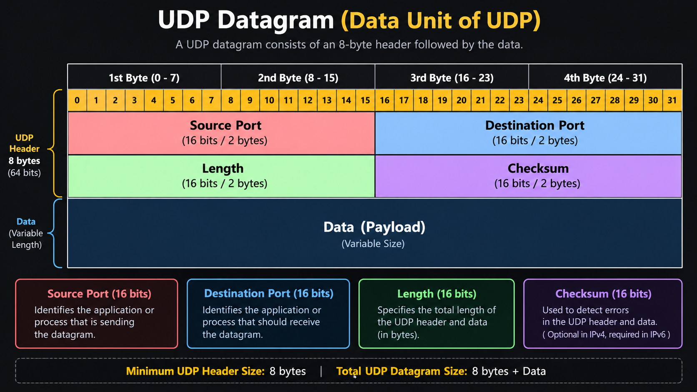
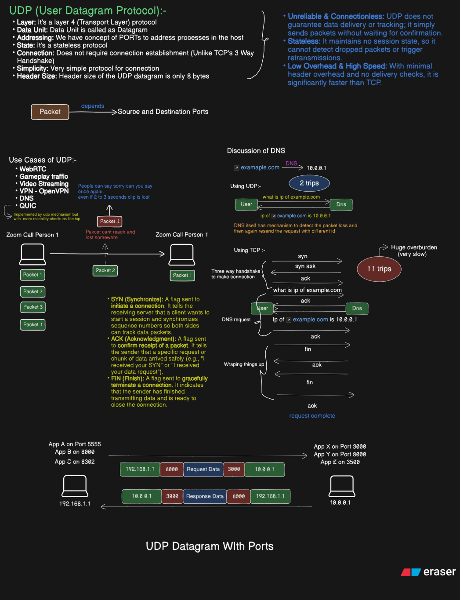

# UDP (User Datagram Protocol)

UDP is a **Layer 4 transport protocol** used for communication between applications over a network. It is designed to be simple, lightweight, and fast.

Unlike TCP, UDP does not establish a connection and does not provide built-in reliability, ordering, retransmission, flow control, or congestion control. This makes it useful when **low latency and low overhead matter more than guaranteed delivery**.

---

## 1. Key Characteristics

### Layer
UDP operates at **Layer 4 (Transport Layer)** of the OSI model.

```text
Application Layer
       ↓
Transport Layer  ← UDP
       ↓
Network Layer
       ↓
Data Link Layer
       ↓
Physical Layer
```

### Connectionless and Stateless
UDP is **connectionless** and **stateless**. The sender does not need to open a connection before sending data, and the protocol does not maintain a session state.

### Datagram-Based
UDP sends data in **datagrams** rather than as a continuous byte stream. Each packet is treated independently.

### Low Overhead
UDP has a very small header, only **8 bytes**, so it adds much less overhead than TCP.

---

## 2. IP Address vs Port

An **IP address identifies a host**, while a **port identifies an application or process** on that host.

```text
192.168.1.10:8000
```

- 192.168.1.10 → Host
- 8000 → Application/process

This is why multiple programs can communicate on the same machine using different ports.

---

## 3. UDP Header and Ports

A UDP datagram includes an **8-byte header** and the payload data.



The diagram shows the header followed by the application data. Read its four 16-bit fields in order:

| Field | Size |
| ----- | ---- |
| Source Port | 16 bits |
| Destination Port | 16 bits |
| Length | 16 bits |
| Checksum | 16 bits |

Together, these fields make the UDP header **8 bytes** long. The **source port** identifies the sending application endpoint, and the **destination port** lets the receiving operating system deliver the payload to the appropriate socket. **Length** counts the entire UDP datagram, including the header and payload. **Checksum** helps detect corruption; it does not provide retransmission or guaranteed delivery.

After the header comes the **payload**, the data supplied by the application. IP carries the UDP datagram between hosts, and the destination port is used to deliver that data to the right application on the destination host.



---

## 4. Why UDP Is Useful

UDP is useful when speed matters more than perfect delivery.

Examples:
- DNS queries
- Video calls
- Voice communication
- Online gaming
- Real-time streaming

For these applications, waiting for lost packets or retransmission may cause delay, so receiving the newest data quickly can be more important than total reliability.

---

## 5. UDP Is Unreliable

UDP does **not guarantee**:
- delivery to the destination
- packet ordering
- automatic retransmission

If a packet is lost, UDP does not resend it by itself. This means the application must handle reliability if needed.

```text
Sent:      Packet 1 → Packet 2 → Packet 3 → Packet 4
Received:  Packet 1 → Packet 3 → Packet 4 → Packet 2
```

The packet order may change, and some packets may never arrive.

---

## 6. UDP vs TCP

| Feature | UDP | TCP |
| ------- | --- | --- |
| Connection | Connectionless | Connection-oriented |
| State | Stateless | Stateful |
| Reliability | No guarantee | Guaranteed |
| Ordering | Not guaranteed | Guaranteed |
| Retransmission | No | Yes |
| Handshake | No | Yes |
| Header | 8 bytes | 20+ bytes |
| Overhead | Low | Higher |
| Typical Use | Real-time apps | Reliable data transfer |

TCP is better for dependable communication, while UDP is better for fast, lightweight communication.

---

## 7. DNS Example

DNS often uses UDP for simple queries.

```text
Client                         DNS Server
"What is the IP of example.com?" ─────►
                                     ◄──── "10.0.0.1"
```

The client sends a query without first setting up a TCP connection. This keeps overhead low. If a DNS response is lost, the client or DNS software can retry.

---

## 8. QUIC and UDP

QUIC is a modern protocol built on top of UDP. It adds reliability, encryption, and congestion control, but still uses UDP as the underlying transport.

```text
Application
     ↓
    QUIC
     ↓
    UDP
     ↓
    IP
```

This shows that UDP can be used as a low-level transport while higher-level protocols add the features needed for more reliable communication.

---

## 9. Summary

UDP is a **simple, fast, connectionless transport protocol** that uses **ports** to deliver data to applications.

Its main ideas are:

- Layer 4 protocol
- Connectionless
- Stateless
- 8-byte header
- No guaranteed delivery
- No guaranteed ordering
- No built-in retransmission
- Low latency and low overhead

UDP is best when **speed and simplicity** are more important than guaranteed delivery.
